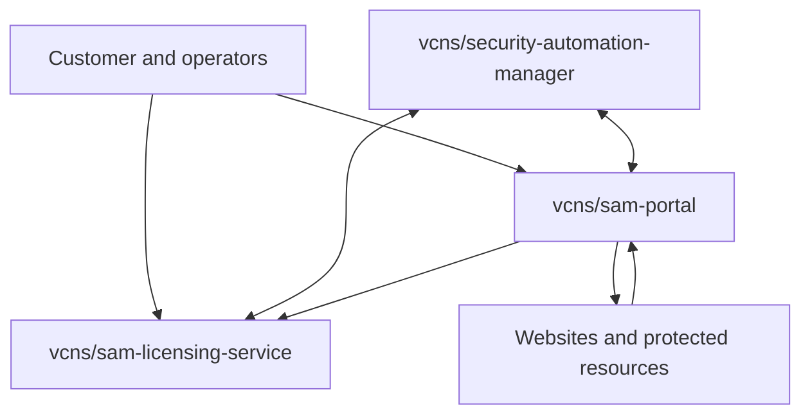

# VCNS SAM Platform
## Portal and Component Requirements Specification

**Product family:** VCNS Security Automation Manager (SAM)  
**Repositories:**

- `vcns/security-automation-manager` — WordPress edge and enforcement component
- `vcns/sam-licensing-service` — licensing, subscription and entitlement authority (renamed from `vcns/licenseing-service`)
- `vcns/sam-portal` — customer, fleet-management and assurance platform to be built

**Public services:**

- `https://sam.vcns.tech` — SAM Portal user interface and public API
- `https://licensing.vcns.tech/v1` — fixed production licensing API origin

**Baseline:** current released `vcns/security-automation-manager` behaviour and the existing licensing-service implementation  
**Status:** Architecture and requirements baseline for implementation  
**Date:** 4 September 2026

---

# 1. Purpose

SAM is a product family composed of independently deployable components. It is not one WordPress plugin enlarged into a cloud application, and the portal is not a renamed licensing proxy.

The product family shall provide:

1. A locally autonomous WordPress security component.
2. A separately deployed licensing and subscription authority.
3. A separately deployed portal for customers, fleet management, assurance, policy governance, hosted reporting and external verification.
4. Versioned protocols that allow the components to operate together without sharing databases, secrets or implementation internals.
5. Standalone portal operation for protected resources that do not run the WordPress plugin.

This document replaces the earlier minimal “checkout and licence validation portal” model. That responsibility belongs to `vcns/sam-licensing-service`. The new `vcns/sam-portal` is a distinct sister product.

Older consolidation ledgers, phase numbers and task numbers are historical evidence, not authoritative requirements. Where they conflict with this specification and current code, this specification and the current codebase take precedence.

---

# 2. Product and Repository Boundaries

| Component | Primary responsibility | Must operate independently? | Must not own |
|---|---|---:|---|
| `vcns/security-automation-manager` | WordPress observation, local policy, approval, enforcement, rollback, certificates, evidence and audit | Yes | Stripe secrets, fleet tenancy, cross-site intelligence authority |
| `vcns/sam-licensing-service` | Stripe Checkout, subscriptions, trials, licences, installations, seats and signed entitlements | Yes | Fleet telemetry, CSP reports, policy authoring, WordPress enforcement |
| `vcns/sam-portal` | Customer accounts, protected resources, hosted reporting, fleet assurance, remote policy governance, scanning, findings and notifications | Yes | Stripe secret authority, local WordPress enforcement, arbitrary remote execution |

The three repositories shall have separate CI/CD, secrets, storage, deployment permissions, incident boundaries and release versions.

A compromise of the portal must not expose Stripe secrets or permit the portal to mint entitlements. A compromise of the licensing service must not expose site evidence or permit direct policy enforcement. A compromise of one WordPress installation must not grant access to another customer or resource.

No component may depend on a shared writable database. Integration shall occur through documented, authenticated and versioned APIs and signed artefacts.

---

# 3. Operating Modes

## 3.1 WordPress-only mode

The WordPress component shall remain a complete, useful product without either hosted service. It shall continue to observe, decide, control and verify locally.

Loss of the portal or licensing service must not:

- remove an enforced security header;
- weaken an existing policy;
- disable certificate management;
- erase evidence or audit records;
- block wp-admin or WP-CLI administration;
- prevent safe disablement, removal or rollback.

Commercial entitlement failure may remove access to a separately distributed commercial capability according to the entitlement grace policy. It must not disable free, already-enforced security controls.

## 3.2 Portal-only mode

The portal shall support customers who do not install `vcns/security-automation-manager`.

A protected resource may be enrolled through one or more of:

- CSP `report-uri` or `report-to` configuration;
- Apache, Nginx or IIS header configuration;
- CDN, reverse-proxy or edge-worker configuration;
- a future Linux, Windows, Docker or Kubernetes adapter;
- public endpoint scanning;
- manual import of current policies and response headers.

Portal-only operation can observe, analyse, recommend and distribute configuration. It can enforce only where a customer installs or configures an explicit enforcement adapter. The portal must never imply that receiving reports alone gives it control of the origin server.

## 3.3 Integrated mode

The WordPress component and portal may be linked for:

- signed, encrypted evidence upload;
- hosted CSP report ingestion;
- fleet posture and drift reporting;
- policy proposals and approvals;
- delivery of signed policy bundles;
- verification of public behaviour;
- incident and certificate notifications.

The WordPress component remains the local enforcement authority. Remote changes shall be bounded by locally configured administrator policy.

## 3.4 Licensing-independent portal mode

Portal tenancy and protected-resource enrolment shall not technically require a WordPress installation or a WordPress-specific licence identity. Product packaging may require a subscription for selected hosted features, but the portal data model and protocol must remain usable for trials, internal accounts and future non-WordPress products.

---

# 4. Architectural Principles

The following distinctions are mandatory:

- identity is not authorisation;
- an observation is not a finding;
- a finding is not an enforcement decision;
- intelligence is not policy;
- a proposed policy is not an approved policy;
- cloud correlation is not cloud control;
- licensing entitlement is not portal authentication;
- portal availability is not a prerequisite for local security.

The product lifecycle and portal navigation spine shall be:

1. **Observe** — collect reports, scans, evidence and changes.
2. **Decide** — explain findings, assess confidence and propose action.
3. **Control** — approve, distribute and locally apply bounded policy.
4. **Verify** — confirm the actual public result and retain evidence.

The portal landing page shall be Overview. Settings shall be the default detailed configuration workspace.

---

# 5. Component Architecture

The arrows represent authenticated API or browser interactions, not shared storage.

## 5.1 Licensing integration

`vcns/sam-licensing-service` is the sole authority for:

- Stripe customers and Checkout Sessions;
- subscription, trial and plan state;
- licence and seat allocation;
- installation activation, deactivation and transfer;
- entitlement signing and revocation;
- grace-period policy;
- server-owned product, price and feature mapping.

The portal shall redirect customers to licensing-service-controlled Checkout and billing-management flows. It may display cached subscription state, but it must validate signed entitlements or use an authenticated server-to-server licensing API. It shall never infer paid access from a browser return URL, webhook supplied by a customer, or portal database flag.

Stripe secret keys and webhook secrets shall exist only within the licensing service's production secret store. They shall not exist in the WordPress database, portal runtime, portal repository or browser.

The existing `vcns/licenseing-service` repository shall be renamed to `vcns/sam-licensing-service`. Redirects and repository references shall be updated without changing the fixed production API origin unless a separately approved migration is designed.

## 5.2 Portal integration

`vcns/sam-portal` shall own:

- tenants, users, teams and roles;
- protected resources and environments;
- integration enrolment and key management;
- hosted report ingestion;
- scans, observations, findings and evidence;
- cross-resource posture and drift;
- proposed, approved and distributed policy versions;
- notification routing;
- fleet dashboards and assurance reporting;
- links to licensing customers and entitlements.

## 5.3 WordPress integration

`vcns/security-automation-manager` shall own:

- local WordPress configuration;
- local observations and evidence;
- local policy evaluation;
- local approvals required by administrator policy;
- header and certificate enforcement;
- rollback and recovery;
- local audit history;
- queued outbound evidence;
- verification of portal signatures before accepting remote artefacts.

The plugin shall call a defined SAM protocol. It shall not accept arbitrary executable instructions, arbitrary callback URLs, arbitrary scan targets or remotely supplied PHP.

---

# 6. Tenancy, Identity and Access

The portal shall be multi-tenant from its first production data model even if the first release has one VCNS-operated deployment.

Minimum roles:

| Role | Scope |
|---|---|
| Owner | Tenant ownership, billing link, destructive operations and role administration |
| Administrator | Resources, integrations, policies, approvals and notifications |
| Approver | Approve or reject policy and exception proposals |
| Analyst | Investigate observations, findings, scans and evidence |
| Viewer | Read-only access to authorised resources and reports |
| Service identity | Narrow machine-to-machine permissions for one integration purpose |

Every persisted object shall carry a tenant identifier and, where applicable, a protected-resource identifier. Authorisation shall be checked at the service layer and storage boundary. Object identifiers must not be usable to cross tenant boundaries.

Privileged actions shall require recent authentication and shall produce an immutable audit event.

Portal account authentication, installation identity and licensing identity shall be distinct. They may be linked, but one shall not silently confer the permissions of another.

---

# 7. Protected Resources and Enrolment

The generic managed object shall be a **protected resource**, not a WordPress installation. A resource may represent a website, API, application, hostname, environment, proxy or future workload.

Minimum fields:

- stable resource ID;
- tenant ID;
- display name;
- canonical origin;
- allowed hostnames;
- environment;
- resource type and adapter type;
- domain-verification state;
- reporting endpoint token state;
- integration public keys and key versions;
- current approved policy version;
- last observation, report, scan, contact and verification timestamps;
- licensing linkage, if applicable;
- retention and data-residency settings.

Before active scanning, policy distribution or authenticated integration, the customer shall prove control using an approved mechanism such as DNS TXT, HTTP well-known challenge or a signed adapter enrolment.

CSP reporting endpoints are intentionally reachable by browsers and must be treated as untrusted ingestion endpoints. A report token identifies a route; it is not proof that a report is truthful and must not grant read or control access.

---

# 8. Secure Component Protocol

All privileged component communication shall use HTTPS plus application-layer protection.

## 8.1 Message requirements

Each signed request or artefact shall include:

- protocol version;
- product/component identifier;
- tenant and resource identifiers where applicable;
- sender key ID;
- issued-at timestamp;
- expiry timestamp where applicable;
- unique nonce or message ID;
- body digest;
- declared content type;
- signature.

Receivers shall enforce clock tolerance, nonce replay protection, payload size limits, schema validation, key status and protocol compatibility.

## 8.2 Mutual authentication

Machine integrations shall use asymmetric installation or service keys. Private keys must be generated and retained by the component that owns them. The portal shall store public keys and metadata, not customer private keys.

Initial enrolment shall prove key possession. Domain control must be verified separately when domain authority matters; trust on first use is not domain verification.

## 8.3 Payload encryption

Sensitive bidirectional payloads shall be encrypted at the application layer in addition to TLS. Encryption and signing are separate controls and shall use separate keys.

The final cryptographic profile shall be selected through an implementation security review and cross-runtime test vectors. It shall provide:

- authenticated encryption;
- fresh per-message nonces;
- explicit key IDs and algorithms;
- associated data binding the protocol metadata;
- forward-compatible key rotation;
- deterministic canonicalisation for signatures;
- interoperability across supported PHP versions and the portal runtime.

No bespoke cipher construction is permitted. Initial candidates may use an audited ECDH/HKDF envelope with AES-256-GCM or XChaCha20-Poly1305, subject to runtime support and test-vector approval.

## 8.4 Key lifecycle

The design shall cover enrolment, rotation, overlap, revocation, recovery and compromise. Production and staging shall use separate origins, storage, keys, Stripe accounts or modes, and trust roots.

## 8.5 Outages and queues

The WordPress component shall continue with the last locally approved and valid policy. It shall queue bounded evidence for later delivery and expose queue age, dropped-item counts and delivery failures locally.

Remote policy expiry shall produce a visible degraded state, not an automatic weakening of local enforcement.

---

# 9. Hosted Reporting

The portal shall expose resource-specific endpoints for CSP reports and future structured browser reports.

It shall:

- accept the standard CSP reporting content types and controlled compatible variants;
- reject oversized, malformed, deeply nested or unsupported payloads;
- normalise legacy `report-uri` and Reporting API formats into one schema;
- rate-limit by token, tenant signals, source and behaviour;
- deduplicate repeated events;
- preserve the original report only when retention policy permits;
- classify all inbound values as attacker-controlled;
- neutralise HTML, URLs, Unicode control characters and spreadsheet-formula injection in every display or export;
- avoid fetching a reported URL merely because it appears in a report;
- record processing and rejection reasons without echoing dangerous payloads;
- notify on malicious or suspicious submissions without allowing notifications to become a payload-delivery channel.

The service shall distinguish a CSP violation reported by a browser from evidence that the named source is malicious. Reports contribute observations; correlation and verification produce findings.

---

# 10. External Verification and Scanning

The portal may scan customer-authorised public endpoints to verify:

- status codes and redirect chains;
- effective security headers and CSP;
- report-only versus enforced policy;
- cookies visible in responses;
- TLS and certificate posture;
- DNS records relevant to assurance;
- cache and CDN variation;
- script, stylesheet, frame, font, image and connection dependencies;
- Subresource Integrity where applicable;
- policy drift across front-end, login and administration surfaces.

## 10.1 Scan safety

The scanner shall prevent SSRF and infrastructure abuse:

- scan only verified, authorised resources and explicitly allowed hostnames;
- resolve and re-check DNS at connection time;
- block loopback, link-local, private, reserved, metadata and non-routable destinations;
- bound redirects, response bytes, time, concurrency and content decompression;
- disallow arbitrary ports and schemes;
- use controlled egress;
- never send stored credentials to a discovered third-party origin;
- log every target decision;
- support per-tenant and global kill switches.

A customer-supplied directive URL is data, not permission to fetch it.

## 10.2 Dependency and payload analysis

The portal may retrieve authorised public dependencies observed in policies or pages and analyse them for:

- unexpected content-type or redirect changes;
- executable payloads where a passive resource is expected;
- obfuscation and known malicious indicators;
- suspicious domain, ASN or certificate changes;
- dependency drift;
- known vulnerable library signatures;
- mismatches between declared, observed and approved origins.

A detection shall retain provenance: protected resource, page/surface, referring policy or report, discovery time, fetch chain, hashes, detector version and confidence.

The portal shall explain likely origin, such as a WordPress plugin, theme, tag manager, embedded vendor or compromised dependency, only where evidence supports the attribution. It must label inference and uncertainty. “Suspicious plugin” is a finding hypothesis, not an automatic accusation or removal instruction.

Active scanning, third-party payload retrieval and any submission to external reputation services shall be observe-only by default and require explicit tenant configuration.

---

# 11. Observations, Findings and Intelligence

The portal data model shall separate:

1. Raw or normalised observations.
2. Correlated evidence.
3. Findings with severity, confidence and explanation.
4. Policy proposals.
5. Human or bounded automated decisions.
6. Enforcement results.
7. Independent verification results.

Findings shall include:

- affected resources and surfaces;
- first and last seen;
- evidence references;
- detector and ruleset version;
- confidence and severity;
- plain-language explanation;
- likely source and uncertainty;
- recommended investigation and remediation;
- status, owner and decision history;
- false-positive and suppression rationale.

Federated intelligence, when introduced, shall exchange significant, minimised and preferably anonymised observations rather than raw logs. Central correlation may publish signed detector or intelligence updates. Local policy still determines whether and how they are used.

---

# 12. Policy Governance and Distribution

The portal shall manage versioned policy proposals and approvals for supported adapters.

A policy bundle shall contain:

- schema and protocol versions;
- tenant and resource scope;
- surface scope, including front-end, login and administration where supported;
- complete directive or control values;
- provenance and proposal rationale;
- approval identity and timestamp;
- effective and expiry times;
- compatibility requirements;
- rollback reference;
- signer key ID and detached signature.

The portal shall not distribute partial string patches whose result depends on unknown local state. Adapters shall validate, simulate where supported, stage, apply atomically, verify and retain the previous known-good version.

Remote automatic approval shall be disabled by default. Where enabled, it shall be constrained by explicit local rules, confidence thresholds, change classes and a kill switch. The WordPress administrator may require local approval for any or all remote proposals.

Time-bound exceptions and advanced simulation are portal/future-adapter capabilities, not prerequisites for the current WordPress edge phase.

---

# 13. Fleet Management and Assurance

Fleet management belongs in `vcns/sam-portal`, not in a fork of the WordPress repository.

The portal shall provide cross-resource views for:

- posture and control coverage;
- policy versions and drift;
- open findings and ageing;
- report volume and abuse;
- integration health and last contact;
- certificate state and renewal risk;
- pending proposals and approvals;
- verification failures;
- evidence freshness;
- software/component versions;
- licensing and seat allocation, by reference to the licensing authority.

The portal shall support filters by tenant, team, environment, resource type, adapter, risk, policy and status. Fleet actions must be previewable, scoped, authorised, auditable and reversible where the adapter supports reversal.

The portal must not become a generic remote shell. Fleet operations are typed protocol commands with schemas, permissions and adapter-declared capabilities.

---

# 14. Customer Experience

Minimum portal areas:

- **Overview** — fleet posture, urgent findings, pending decisions and integration health.
- **Observe** — reports, scans, dependencies, evidence and timelines.
- **Decide** — findings, explanations, proposals, exceptions and approvals.
- **Control** — approved policies, distribution state, adapter capabilities and rollback.
- **Verify** — external checks, drift, certificates and assurance history.
- **Settings** — tenant, users, resources, integrations, keys, notifications, retention and billing link.

Onboarding shall allow a customer to:

1. Create or join a tenant.
2. Add and verify a protected resource.
3. Select WordPress, header-only, reporting-only, proxy/CDN or another available adapter.
4. Receive exact host-header and CSP reporting instructions.
5. Test report delivery or integration authentication safely.
6. Observe the current posture before enabling control.
7. Select notification and retention preferences.

Every recommendation must answer: what was observed, why it matters, how certain SAM is, where it probably originated, what will change, who approved it, and how the result will be verified.

---

# 15. Billing, Trials and Entitlements

Commercial portal access shall use Stripe subscriptions through `vcns/sam-licensing-service`.

The licensing service's existing architecture — signed requests, Ed25519 installation identities, Durable Objects as mutation authority, KV projections, an isolated entitlement signer, trials and seat-aware plans — is the implementation baseline, subject to its own security review and remediation.

Before production use, the licensing service must address at least:

- safe, atomic transfer semantics across installation and licence authorities;
- explicit entitlement revocation operations;
- durable audit storage and alerting;
- real Stripe test-mode end-to-end verification;
- application-layer encryption where sensitive payloads require it;
- domain verification separate from installation key possession.

The portal shall consume only signed, current entitlement state. Cached state shall have a defined maximum age and grace behaviour. Billing outages shall not cause the portal to destroy tenant data, and licensing outages shall not weaken locally enforced controls.

The WordPress.org edition remains a complete free plugin. Commercial value should be delivered through the separate hosted intelligence, assurance, fleet and automation services rather than by placing dormant paid code inside the WordPress.org package.

---

# 16. Data Protection and Retention

The portal shall implement data minimisation by default.

Required controls:

- tenant-configurable retention within product limits;
- separate retention for raw reports, normalised observations, evidence and audit;
- encryption at rest and in transit;
- application-layer encryption for sensitive component messages;
- field-level treatment of secrets and private keys;
- regional/data-residency decisions recorded before production;
- export and deletion workflows;
- legal hold behaviour, if introduced;
- backup, recovery and deletion propagation tests;
- documented subprocessors and external reputation services;
- redaction of query strings, credentials, tokens and personal data where not required;
- no use of customer payloads to train models without explicit, separate consent.

CSP reports and URLs may contain personal data, tokens or sensitive paths. They shall never be assumed harmless telemetry.

---

# 17. Audit and Evidence

Security-relevant events shall be append-only and tamper-evident to the practical extent supported by the selected storage.

Audit events shall include:

- actor or service identity;
- tenant and resource;
- action and object;
- previous and resulting version references;
- timestamp and request correlation ID;
- source IP or trusted network context where appropriate;
- authorisation decision;
- approval and exception rationale;
- cryptographic key ID;
- delivery, enforcement and verification result.

Customer-facing assurance exports shall include evidence provenance and detector/policy versions so that a later reviewer can reproduce what SAM knew and decided at the time.

---

# 18. Availability and Failure Behaviour

Each component shall publish availability objectives after its first measured production baseline.

Mandatory failure behaviour:

- portal loss: edge continues locally and queues bounded evidence;
- licensing loss: signed cached entitlements follow grace policy;
- Stripe loss: existing customers retain service according to entitlement policy; new Checkout may be unavailable;
- scanner loss: enforcement is unchanged and verification is marked stale;
- report-ingestion overload: fail closed on storage admission, protect tenant boundaries and expose loss counters;
- signature or decryption failure: reject the message, retain safe diagnostics and alert;
- incompatible protocol: reject unsupported mutation, preserve current policy and provide an upgrade path.

Backups, restore tests, key recovery, incident response, dependency pinning, secret scanning and production rollback are release requirements, not post-launch enhancements.

---

# 19. API and Schema Governance

The portal and licensing APIs shall be versioned independently. The product family shall maintain shared canonical schemas and test vectors without creating a runtime dependency on a fourth service.

Each repository shall run compatibility tests against the protocol versions it claims to support. Breaking changes require a new protocol version and a documented overlap window.

API responses shall use stable machine-readable error codes, correlation IDs and bounded diagnostic text. Secrets, report payloads and cryptographic material shall not appear in URLs or logs.

Public browser-report endpoints, customer APIs, component APIs, administrative APIs and internal service APIs shall have distinct authentication and rate-limit policies.

---

# 20. Delivery Plan

Phase labels below describe dependency order only. They do not reuse historical roadmap task numbers.

## Foundation

- Rename `vcns/licenseing-service` to `vcns/sam-licensing-service`.
- Correct repository, workflow, documentation and deployment references.
- Establish `vcns/sam-portal` with ownership, threat model, CI/CD, environments and architecture decisions.
- Publish the initial protocol schemas and cross-runtime cryptographic test vectors.
- Remove production Stripe secrets from every customer-controlled WordPress path.

## Portal minimum viable service

- Tenant authentication and RBAC.
- Protected-resource enrolment and domain verification.
- CSP reporting ingestion and safe normalisation.
- Public external header/CSP/TLS scanning.
- Findings, evidence and notification workflow.
- Licensing-service Checkout, subscription and entitlement integration.
- Portal-only setup instructions for common host-header configurations.

## Integrated SAM

- WordPress enrolment.
- Signed and encrypted evidence upload.
- Resource and fleet posture.
- Signed policy proposals and controlled distribution.
- Local approval, rollback and independent external verification.
- Offline queues, key rotation and recovery exercises.

## Assurance and fleet expansion

- Cross-resource governance.
- Dependency and payload intelligence.
- Certificate and drift risk management.
- Broader adapters for proxies, Linux, Windows, Docker and Kubernetes.
- Federated intelligence, explicitly separated from local authorisation.
- Time-bound exceptions and advanced policy simulation.

No phase may be declared complete solely because UI exists. Security properties, failure behaviour, auditability and end-to-end tests are part of each deliverable.

---

# 21. Migration From Current Implementations

## 21.1 Repository rename

The licensing repository rename shall preserve GitHub redirects, then update:

- package metadata and README;
- checkout and status links;
- CI/CD references and badges;
- issue and documentation links;
- deployment identities and environment documentation;
- internal service-to-service allow-lists;
- operational runbooks.

The historical misspelling `licenseing-service` shall not remain in new product-facing names.

## 21.2 WordPress direct-Stripe removal

Any remaining direct-Stripe compatibility path in a commercial WordPress build shall be migrated to `sam-licensing-service`, deprecated and removed on an explicitly approved schedule. VCNS Stripe credentials previously distributed to customer-controlled databases shall be rotated.

## 21.3 Existing local evidence

Portal integration shall be opt-in. It shall not silently upload historical local evidence. The administrator shall choose whether to begin with new events only or import a defined, previewed date range.

## 21.4 Current portal draft

The previous one-record KV licence-key portal design is superseded. Its useful threat analysis may be retained in licensing-service documentation, but it is not the architecture for `vcns/sam-portal`.

---

# 22. Non-Goals and Prohibited Designs

The following are explicitly prohibited:

- merging all three components into one repository or deployment;
- making the WordPress edge depend on continuous cloud availability;
- storing Stripe secret or webhook keys in WordPress or the portal;
- allowing the portal to mint or alter entitlement truth;
- using licence keys as portal session credentials;
- accepting arbitrary remote code, shell commands or PHP;
- fetching arbitrary customer-supplied URLs;
- treating unverified CSP reports as proof;
- weakening local controls when reporting, scanning, billing or licensing is unavailable;
- sharing production and staging keys, storage or trust roots;
- describing probable plugin or dependency attribution as established fact;
- enabling active or federated intelligence collection without clear customer control.

A self-hosted or customer-hosted portal deployment may be considered later, but it shall use the same protocol and must not be assumed in the first hosted-service release.

---

# 23. Definition of Done

The componentised SAM platform baseline is complete when:

- `vcns/sam-licensing-service` exists under the approved name and is the only Stripe and entitlement authority;
- `vcns/sam-portal` exists as a separate repository and deployment;
- the portal can onboard and verify a non-WordPress protected resource;
- the portal can receive hostile CSP reports safely and convert them into bounded observations;
- authorised external scans cannot reach internal or unauthorised network targets;
- the portal can explain and evidence a finding without treating it as an automatic enforcement decision;
- a WordPress installation can enrol with mutually authenticated, signed and encrypted messaging;
- the plugin continues enforcing its last approved policy during portal and licensing outages;
- remote policy distribution is typed, signed, locally bounded, auditable and reversible;
- Stripe Checkout and subscription state are delegated to the licensing service;
- tenant isolation, RBAC, key rotation, replay resistance, retention, backup and recovery are tested;
- the portal presents fleet posture across multiple protected resources;
- end-to-end tests cover Observe, Decide, Control and Verify in portal-only and integrated modes;
- the production threat model, data-flow inventory, incident runbook and privacy disclosures have been reviewed.

---

# 24. Decisions Fixed by This Specification

The following are no longer open questions:

1. **SAM is a product family**, not the name of one repository.
2. **The licensing service is separate** and shall be named `vcns/sam-licensing-service`.
3. **The portal is separate** and shall be built as `vcns/sam-portal`.
4. **Fleet management belongs to the portal**, not to a fork of the WordPress plugin.
5. **The portal supports independent operation** through reporting, public verification and explicit host/proxy adapters.
6. **The WordPress component remains locally autonomous.**
7. **Stripe Checkout and subscriptions belong to the licensing service.**
8. **Privileged component communication uses mutual authentication, signing, replay protection and payload encryption in addition to TLS.**
9. **Remote control is typed and bounded; arbitrary remote execution is prohibited.**
10. **Current code and this specification outrank obsolete roadmap numbering and consolidation ledgers.**
